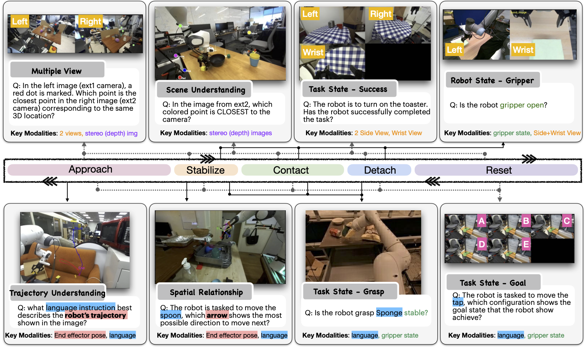
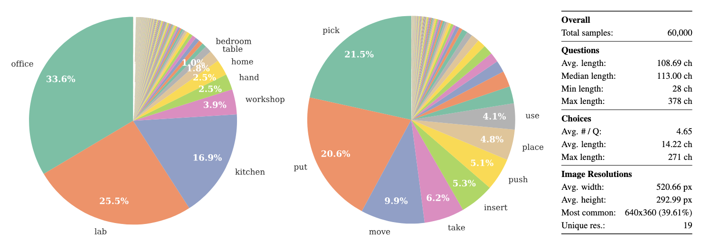
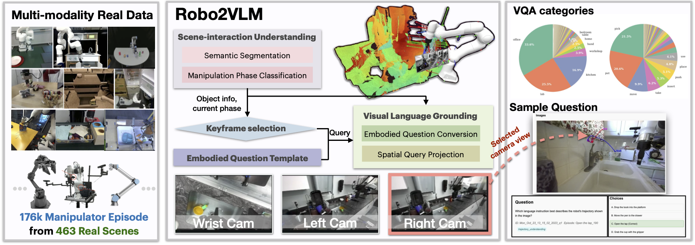
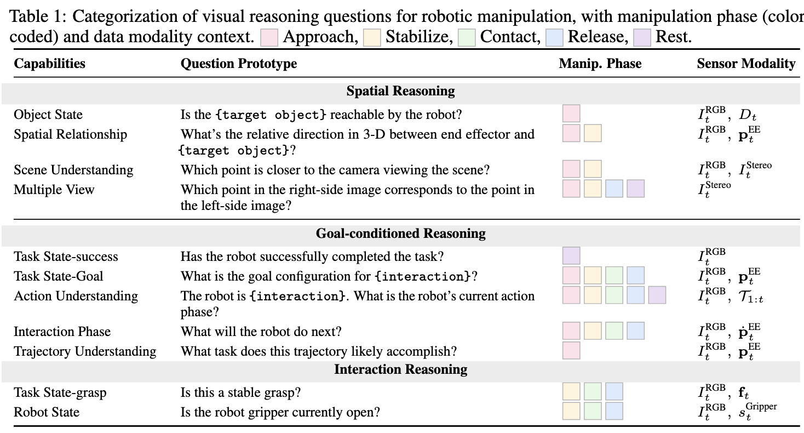
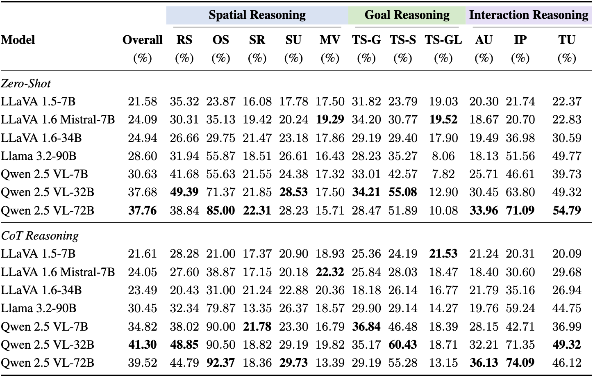
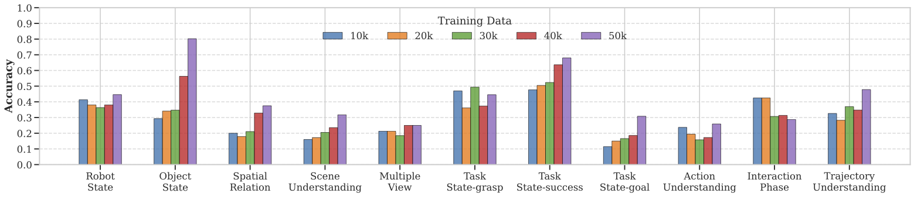

# Robo2VLM: Visual Question Answering from Large-Scale In-the-Wild Robot Manipulation Datasets

🤖 **[Paper](https://arxiv.org/abs/2505.15517)** | 🤗 **[Dataset](https://huggingface.co/datasets/keplerccc/Robo2VLM-1)** | 💻 **[Website](https://berkeleyautomation.github.io/robo2vlm/)**



This repository is used for the 3D Vision course project on **Benchmarking Spatial and State Reasoning Skills for VLMs**.

Using real robot trajectory data to enhance and evaluate Vision-Language Models (VLMs) through grounded visual question answering.

## Project Scope

This codebase builds on `Robo2VLM` and is adapted for benchmarking vision-language models on robotics VQA tasks with an emphasis on spatial reasoning, state understanding, and goal-conditioned manipulation questions.

In addition to the original code, this repository contains cluster-oriented fixes that were required to run the benchmark pipeline on the ETH student cluster:

- CUDA-matched PyTorch installation for newer GPUs such as `5060ti`
- benchmark fixes for single-GPU evaluation
- smaller evaluation subsets for faster runs
- compatibility fixes for current `vLLM` versions
- direct response parsing for multiple-choice evaluation on constrained hardware

## 🔥 Features

- **684,710 VQA questions** from 176K real robot trajectories
- **463 distinct scenes** across diverse environments (office, lab, kitchen)
- **3,396 manipulation tasks** with ground-truth from robot sensors
- **Multi-modal reasoning** using spatial, goal-conditioned, and interaction templates

## 🚀 Quick Start

```bash
# Create and activate a Python environment first
# Then install dependencies, including a CUDA-matched PyTorch build

# Example for ETH student cluster with cuda/13.0
pip install --no-cache-dir torch torchvision torchaudio --index-url https://download.pytorch.org/whl/cu130
pip install --no-cache-dir vllm transformers datasets pillow tqdm numpy huggingface_hub accelerate sentencepiece

# Fine-tune a model
cd finetune/
python main.py --config configs/llama_vision.yaml

# Generate VQA data (requires Docker)
cd generation/
docker build -t robo2vlm .
docker run --gpus all -v $(pwd):/workspace robo2vlm

# Evaluate models
cd benchmark/
python evaluation.py --models Qwen/Qwen2.5-VL-7B-Instruct --max_samples 20 --batch_size 1 --tensor_parallel_size 1

# Evaluate a curated subset after running scripts/recategorize_robo2vlm.py
python evaluation.py --models Qwen/Qwen2.5-VL-7B-Instruct --subset spatial --curation-results ../outputs/robo2vlm_spatial_affordance/curation_results.jsonl --max_samples 20 --batch_size 1 --tensor_parallel_size 1
```

## ETH Cluster Notes

The benchmark path in `benchmark/` relies on `vLLM`, so older `1080ti` nodes are not suitable. Use a newer GPU type such as `5060ti`, load the matching CUDA module, and authenticate with Hugging Face outside the batch job.

Typical Slurm settings used for this repository:

```bash
#SBATCH --account=3dv
#SBATCH --gpus=5060ti:1
#SBATCH --output=/work/courses/3dv/team43/logs/%x-%j.out
```

Batch jobs should not run `hf auth login`. Instead, authenticate once on the login node with the same `HF_HOME` path used by the job.

## 📊 Dataset

Our published dataset `keplerccc/ManipulationVQA` contains:
- **684,710 VQA questions** from real robot trajectories
- **15+ question types** covering spatial and interaction reasoning
- **Multi-modal data** with RGB images, depth, robot states

### Dataset Statistics



*Distribution and key statistics of Robo2VLM-1 dataset. (Left) Robo2VLM-1 covers diverse scenes with the most frequent scenes in office (33.6%), lab (25.3%), and kitchen (16.9%). (Middle) Robo2VLM-1 covers tasks including common manipulation actions include pick (21.5%), put (20.6%), and move (9.9%). (Right) The table summarizes key dataset statistics including question characteristics, answer choices, and image resolutions.*

## 🛠️ Robo2VLM Pipeline



Robo2VLM generates multi-modal real-world robot trajectories through (1) manipulation phase classification, (2) keyframe selection guided by scene and interaction cues, and (3) structured VQA question prototype.

## 📁 Repository Structure

- **`finetune/`** - Complete fine-tuning pipeline with LoRA, Unsloth optimization
  - Supports Llama-3.2-Vision, Qwen2-VL, LLaVa models
  - Configurable training with WandB integration
- **`generation/`** - VQA data generation from robot trajectories  
  - Docker environment with GPU acceleration
  - 15+ question types (spatial, interaction, goal-conditioned)
- **`benchmark/`** - Multi-model evaluation framework
  - vLLM backend for efficient inference
  - Comprehensive accuracy metrics and breakdowns
- **`scripts/`** - HuggingFace dataset creation tools
  - Ray-based parallel processing
  - Direct integration with HF Hub

## 🔧 VQA Question Types



Our framework generates 15+ question categories:

**Spatial Reasoning (S1-S8)**
- Robot gripper state detection
- Object reachability analysis  
- Relative direction and depth perception
- Multi-view correspondence

**Interaction Reasoning (I1-I6)**
- Task success evaluation
- Grasp stability assessment
- Goal configuration identification
- Temporal sequence analysis

## 🎯 Supported Models

- **Llama-3.2-11B-Vision** (primary)
- **Qwen2.5-VL** (7B/32B/72B)
- **LLaVa** (1.5-7B, v1.6-34B, Next-72B)
- **API models**: GPT-4o, Gemini Pro Vision

## 📈 Results

### Benchmark Performance



*Performance Comparison of Multimodal Foundation Models on OpenX-VQA Benchmark Categories (%). Upper part: zero-shot. Lower part: with CoT prompting.*

### Fine-tuning Results



*Fine-tuning LLaVA 1.6 with increasing training data of robo2vlm-1 from 10k to 50k VQA items. Accuracy improvements almost all categories compared to no fine-tuning.*

## 📄 Citation

```bibtex
@misc{chen2025robo2vlmvisualquestionanswering,
    title={Robo2VLM: Visual Question Answering from Large-Scale In-the-Wild Robot Manipulation Datasets}, 
    author={Kaiyuan Chen and Shuangyu Xie and Zehan Ma and Pannag Sanketi and Ken Goldberg},
    year={2025},
    eprint={2505.15517},
    archivePrefix={arXiv},
    primaryClass={cs.RO}
}
